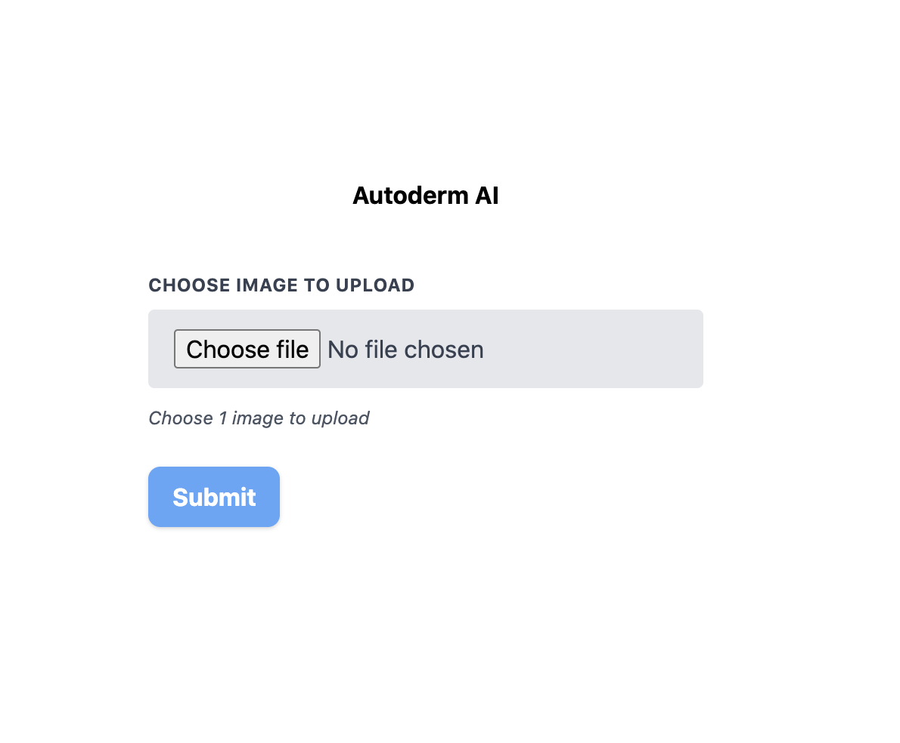
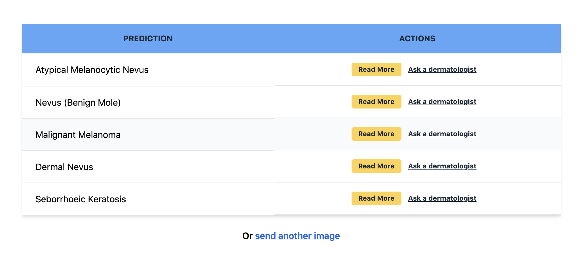

# AI dermatology app in 50 lines of code.

Deep learning has already shown its potential. At [FirstDerm](https://www.firstderm.com/) we are committed to a clear goal. Creating the best tool we can to help identify and diagnose dermatology images. That is why we created the [AI dermatology API]( https://www.firstderm.com/autoderm-dermatology-artificial-intelligence-ai-api/). By using it, you can have a tool at your disposal to recognize dermatology pathologies.

In this post we will show how to create a fully functional web application with, including a backend to interact with it. The best part is that it will take us less than 100 lines of code.

**NOTE:** The app has been updated to work with [our new API](https://autoderm.firstderm.com/).

## The frontend (part 1)

For the frontend we are going to create 2 different html files. The code shown here can be easily written using React, Vue or any frontend framework.

First, we create an `index.html` with a very simple form. Here are the parts needed for the form.

```html
<form method="post" enctype="multipart/form-data" action="/image">
    <label for="image">Choose image to upload</label>
        <input type="file" name="image" accept="image/*" required/>
        <p>Choose 1 image to upload</p>
    <button type="submit" name="submit">Submit</button>
</form>
```

There are a couple of important things here:

First, note the line:  `<form method="post" enctype="multipart/form-data" action="/image">` the `action="/image"` part should be the endpoint where the form data is going to be uploaded. Now we are creating our own backend too. Lets say out main page is at `http://localhost`. The form data would be uploaded to `http://localhost/image`.

Take into account that in order to use [the API](https://www.firstderm.com/autoderm-dermatology-artificial-intelligence-ai-api/) you need to set the API key as a request header. That's why we are also building our backend. If you call the API directly from your website, your users may be able to get your API key and use it on their own. It's recommended that you first get the image in your ouwn backend. After that you can make a request to our API using all the appropiate settings. Without the risk of leaking sensitive information (like the API key).

Moving forward in our form. You can see we are also adding a few fields: **age**, **sex**, **image file** and a **message**. Our API can work using only the image, but it may be useful getting those extra values.

Note down the attribute `name` in the input. We will use those in our backend. In this case the `name` is set to `image`:

```html
<input type="file" name="image" accept="image/*" required/>
```

## The backend

For the backend we will use [FastAPI](https://fastapi.tiangolo.com/). A very developer-friendly and blazing fast python framework to create backend services.

Here is the full app, fully functional en less than 40 lines of code. We'll now go through it.


```python
from fastapi import FastAPI, Form, UploadFile, Request
from fastapi.templating import Jinja2Templates
import uvicorn
import requests
import os

templates = Jinja2Templates(directory=".")
app = FastAPI()

@app.get("/")
async def index(request: Request):
    return templates.TemplateResponse("index.html", {"request": request})

@app.post("/image")
async def process(
    *,
    image: UploadFile = Form(...),
    request: Request,
):
    image_contents = await image.read()
    response = requests.post(
        "https://autoderm.firstderm.com/v1/query?language=en&model=autoderm_v2_0",
        headers={"Api-Key": os.getenv("API_KEY")},
        files={"file": image_contents},
    )

    data = response.json()
    predictions = data["predictions"]

    return templates.TemplateResponse(
        "prediction.html", {"request": request, "predictions": predictions}
    )

if __name__ == "__main__":
    uvicorn.run("main:app", host="0.0.0.0", port=8000, reload=False)
```

After importing the necessary libraries, we need to pay attention to a couple of configuration variables:

```python
templates = Jinja2Templates(directory=".")

headers={"Api-Key": os.getenv("API_KEY")}
```

* `templates`: Tells our app we are out html files. In this case we are also using FastAPI to render the HTML.
* `headers`: A dictionary to set request headers. We use `os.getenv("API_KEY")` in order to read our API key from the environment. Including it directly in the code is not a good practice. We recommend following the [12 factor app](https://12factor.net/) rules. If your are using bash you can use: `export API_KEY=<your_api_key>` in order to have it available as an environment variable.

After that we create our app and a base endpoint to render the `index.html` we built before:

```python
app = FastAPI()

@app.get("/")
async def index(request: Request):
    return templates.TemplateResponse("index.html", {"request": request})
```

Lastly, the most important part. The image processing endpoint:

```python
@app.post("/image")
async def process(
    *,
    image: UploadFile = Form(...),
    request: Request,
):
```

Our endpoint has to accept [form data](https://fastapi.tiangolo.com/tutorial/request-forms/). Do you remember the attributes `name` in the input of our html? Here our paramenter must have the same name (`image`). That's how the website will send it.

```python
image_contents = await image.read()
```

Read the image data. Then we create a dictionary with the key "file" and the contents of our image (bytes) as value. Our API will use by default the latest model and return the results in English, but you can change that with the URL parameters. Using the `requests` library in python, we can build our request like this:

```python
response = requests.post(
        "https://autoderm.firstderm.com/v1/query?language=en&model=autoderm_v2_0",
        headers={"Api-Key": os.getenv("API_KEY")},
        files={"file": image_contents},
    )
```

To finish with our backend, we make a request to our API, get the results and render them.

```python
data = response.json()

predictions = data["predictions"]

return templates.TemplateResponse(
    "prediction.html", {"request": request, "predictions": predictions}
)
```

Our API returns an array of the top results. Each element of that array looks like this:

```
{
    "confidence": 0.5864430665969849,
    "icd": "B02.9",
    "name": "B02.9: Herpes Zoster",
    "classificationId": "3e4f9cbe-d4aa-11e7-a562-0242ac120003",
    "readMoreUrl": "https://www.firstderm.com/herpes-zoster-shingles/",
}
```

## Frontend (part 2)

We have received our results from the API. We can now create a different template to render the results. Remember we are using Jinja2, that's why there are some expressions with `{}`. You can do the same in JavaScript by doing `predictions.map(pred => ...)`. Something equivalent can be done in any framework you use to develop your app.

To render the results as a table:

```html
<table>
    <thead>
        <tr>
            <th>Prediction</th>
            <th>Actions</th>
        </tr>
    </thead>
    <tbody>
        
        <tr>
            <td>{{ prediction["name"] }}</td>
            <td>
                <a href="{{ prediction['readMoreUrl'] }}">Read More</a>
                <a href="https://www.firstderm.com/ask-online-dermatologist/">Ask a dermatologist</a>
            </td>
        </tr>
        
    </tbody>
</table>
<p>Or <a href="/">send another image</a></p>
```

In the code above we are looping over the predictions list/array.
By indexing on `prediction` when we do `prediction["name"]`, we are getting that value from the dictionary we saw before.

## Important things to have in mind.

* The image has to be sent as form data to our API. Here it was done with Python but it can be done in any language or framework you use.
* Keep the API key safe.
* You can process or get the image however you want. Here we were getting the image from an html form, but you could be getting it from a JSON API, just remember to send it to us as form data afterwards.
* Set the API key in your request headers with the name "Api-Key": <your_key>

## Conclusion

After removing blank lines. Both html files and the python app together add up to 48 lines of code. Of course, we have ignored a bit of boilerplate code, and we have not added any styles to our app. You can see the complete app, with all the code and some CSS styles on [GitHub](https://github.com/polyrand/firstderm_demo). This is how it looks:

* Input form



* Results



In times of CoV-19, telemedicine is becoming a must. Check [our API](https://www.firstderm.com/autoderm-dermatology-artificial-intelligence-ai-api/) to include it in any app you build.
